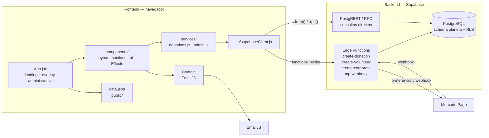
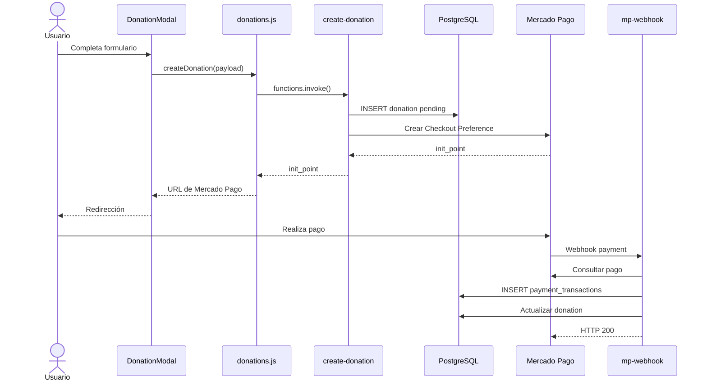
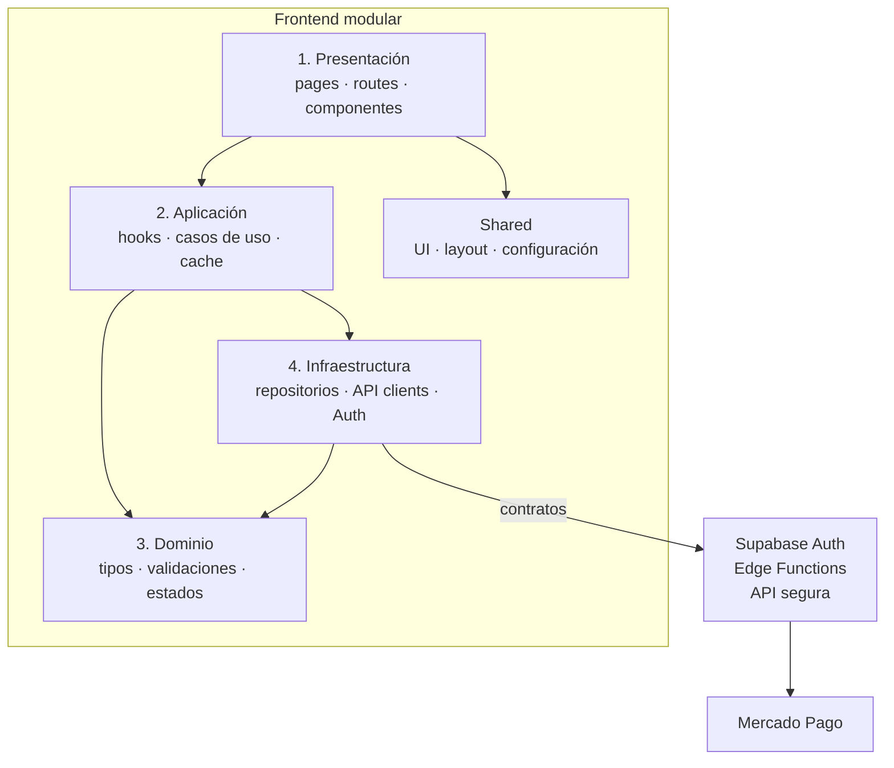
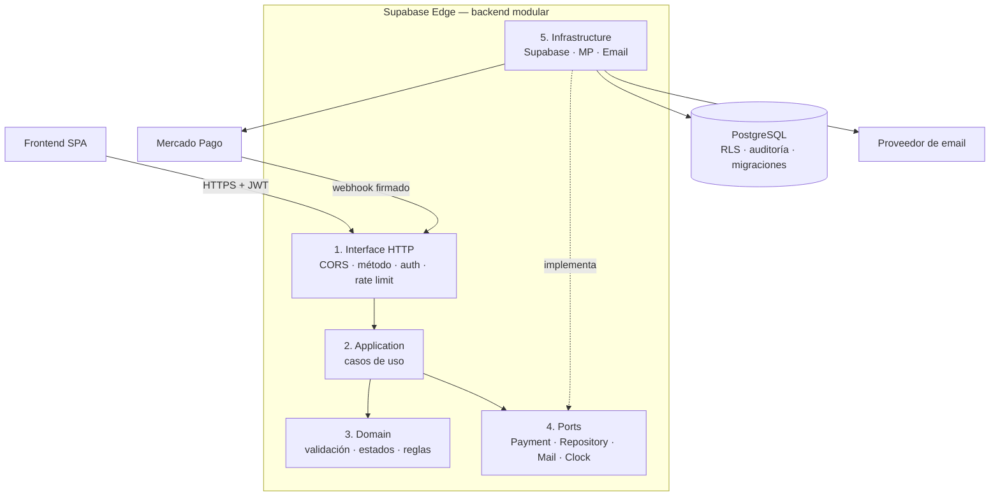
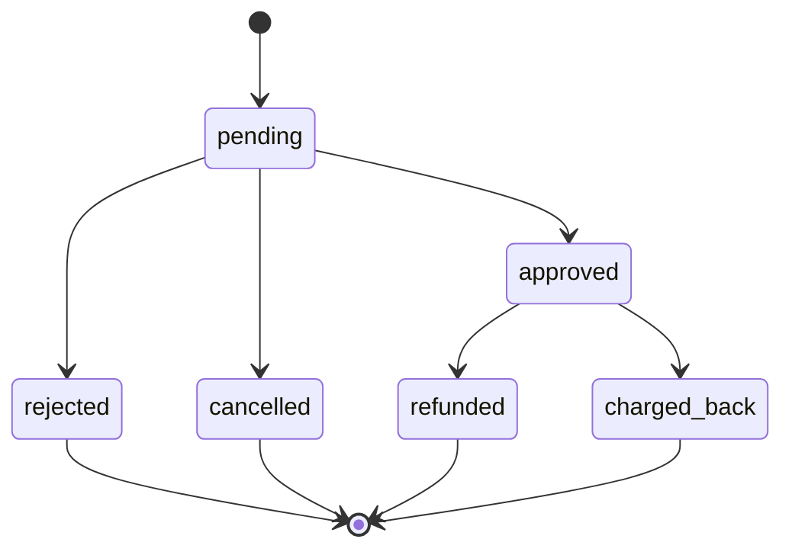
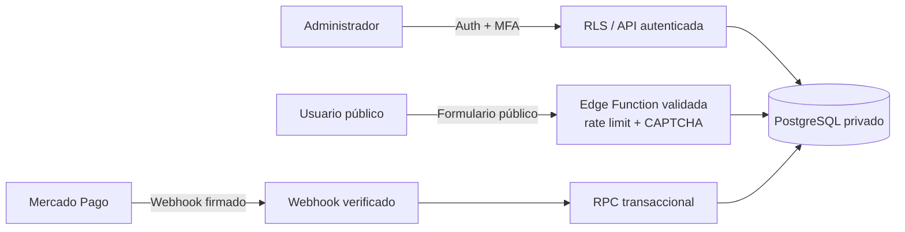

# Arquitectura de Salva el Planeta

> Documento de arquitectura, riesgos y estrategia de evolución del proyecto.
>
> **Estado:** propuesta de evolución sobre la base existente.
> **Alcance:** frontend React, Supabase, Edge Functions, PostgreSQL, RLS y Mercado Pago.

---

## 1. Resumen ejecutivo

El proyecto actual es una **SPA React 17 / Create React App** de una sola página, con contenido estático y tres flujos operativos:

- Donaciones.
- Voluntariado.
- Alianzas corporativas.

El backend no es un servidor Node/Express convencional. Está compuesto por:

- Supabase PostgreSQL.
- Esquema `planeta`.
- Row Level Security.
- Supabase Edge Functions en Deno/TypeScript.
- Integración con Mercado Pago.
- EmailJS para contacto.

La arquitectura actual funciona como MVP, pero presenta problemas de seguridad, acoplamiento y mantenibilidad:

1. El frontend consulta tablas y RPC directamente.
2. El panel administrativo usa una clave compartida en `sessionStorage`.
3. Las políticas RLS permiten lectura pública de datos personales.
4. El webhook de Mercado Pago no valida firmas ni maneja todos los estados.
5. No existen pruebas automatizadas.
6. El panel y los formularios están concentrados en componentes grandes.

## Recomendación

Evolucionar hacia un **monolito modular sobre Supabase**, con:

- Frontend modular por features.
- Capas explícitas de presentación, aplicación, dominio e infraestructura.
- Supabase Edge Functions como BFF seguro.
- Supabase Auth y roles para administración.
- PostgreSQL con RLS, auditoría y eventos de pago.
- Despliegues independientes para frontend y backend.
- Sin microservicios en esta etapa.

> La prioridad no es reescribir el sistema, sino cerrar los riesgos de seguridad y pagos, completar los flujos actuales y después realizar un refactor incremental.

---

## 2. Arquitectura actual

### 2.1 Stack actual

| Área | Tecnología actual |
|---|---|
| Frontend | React 17, React DOM, JavaScript |
| Build | Create React App 5 |
| UI | Bootstrap 3, jQuery 1.11.1, CSS legacy |
| Backend | Supabase Edge Functions / Deno |
| Persistencia | Supabase PostgreSQL |
| Esquema | `planeta` |
| Seguridad | RLS y funciones `SECURITY DEFINER` |
| Pagos | Mercado Pago Checkout Preferences y webhook |
| Email | EmailJS |
| Deploy frontend | GitHub Actions → GitHub Pages |
| Deploy backend | No automatizado en el repositorio |

### 2.2 Diagrama de arquitectura actual



### 2.3 Flujo actual de donación



### 2.4 Capas actuales

| Capa | Archivos principales | Estado |
|---|---|---|
| Bootstrap | `src/index.js`, `public/index.html` | Funcional, monolítico |
| Presentación | `src/App.jsx`, `components/layout`, `components/sections`, `components/ui` | Mezcla UI, estado y datos |
| Servicios | `src/services/donations.js`, `src/services/admin.js` | Acceso directo a Supabase y RPC |
| Infraestructura | `src/lib/supabaseClient.js`, `src/lib/mercadopago.js` | Acoplada a Supabase |
| Contenido | `src/data/data.json` | Estático y validado solo informalmente |
| Backend HTTP | `supabase/functions/*` | Handlers delgados con lógica acoplada |
| Persistencia | `supabase/migrations/*` | Esquema centralizado, RLS demasiado permisivo |
| Integraciones | Mercado Pago, EmailJS | Parcialmente configuradas |
| Deploy | `.github/workflows/deploy.yml` | Solo frontend |

### 2.5 Archivos con mayor acoplamiento

- `src/components/admin/AdminPanel.jsx`: 828 líneas.
- `src/components/ui/DonationModal.jsx`: 316 líneas y tres features.
- `src/services/admin.js`: acceso a datos, sesión administrativa, errores y agregaciones.
- `src/components/sections/Contact/index.jsx`: integración directa con EmailJS.
- `supabase/functions/mp-webhook/index.ts`: validación, integración, persistencia y máquina de estados incompleta.

---

## 3. Riesgos y hallazgos prioritarios

### P0 — Seguridad, privacidad y pagos

| Hallazgo | Evidencia | Impacto |
|---|---|---|
| RLS permite lectura pública | `001_initial_schema.sql:91-106` usa `USING (true)` | Exposición de nombres, correos, teléfonos, mensajes y estados financieros |
| Panel con clave compartida | `src/services/admin.js`, `002_admin_panel.sql` | No hay usuarios, roles, MFA, auditoría ni expiración |
| Webhook sin firma | `mp-webhook/index.ts` | Riesgo de replay, abuso y procesamiento de eventos no confiables |
| Funciones públicas sin rate limiting | `config.toml`, `_shared/cors.ts` | Spam, abuso de recursos y creación masiva de preferencias |
| `service_role` en handlers públicos | Functions de creación | El endpoint debe validar y limitar todas las operaciones |

La clave anónima de Supabase es pública por diseño. El riesgo está en que las políticas y privilegios no protegen los datos.

### P1 — Funcionalidad y consistencia

| Hallazgo | Impacto |
|---|---|
| EmailJS usa placeholders | El formulario de contacto no funciona |
| No hay rutas de resultado de pago | El usuario retorna a URLs sin páginas ni router |
| No se valida `mpResponse.ok` | Puede haber donaciones `pending` sin checkout |
| `donation_id` no se guarda en `payment_transactions` | El panel no puede conciliar pagos automáticamente |
| Reembolsos y cancelaciones no se procesan | Estados financieros incompletos |
| Dashboard descarga hasta 1.000 filas | Totales incorrectos con más registros |
| Listados sin paginación | Carga excesiva de datos y DOM |
| Galería sin inicialización visible de lightbox | Dependencia o CSS incompleto |
| README desactualizado | Configuración y comportamiento no coinciden con el código |

### P2 — Mantenimiento, rendimiento y accesibilidad

- Componentes administrativos y formularios demasiado grandes.
- Bundle inicial incluye panel, EmailJS, Supabase y efectos.
- jQuery y Bootstrap legacy conviven con React.
- No hay `React.lazy` para el panel.
- No hay tests, lint, typecheck o Error Boundary.
- Modales sin roles ARIA completos ni focus trap.
- Tarjetas de servicio implementadas como `div` clicables.
- Imágenes sin dimensiones, lazy loading o `srcset`.
- `FlowerExplosion` puede acumular estados y timers.
- El scroll locking puede ser sobrescrito por dos overlays.
- El contenido presenta métricas y promesas operativas sin backing de datos.

---

## 4. Arquitectura objetivo

### 4.1 Decisión principal

Se recomienda un **monolito modular**, no una arquitectura de microservicios:

```text
Frontend SPA modular
        ↓
Supabase Edge Functions como BFF
        ↓
Casos de uso y dominio
        ↓
Adaptadores de Supabase, Mercado Pago y Email
        ↓
PostgreSQL privado con RLS y auditoría
```

El frontend y el backend deben estar separados lógicamente y desplegarse de forma independiente. Pueden permanecer en el mismo repositorio durante la transición.

### 4.2 Capas del frontend objetivo



### Reglas de dependencia

1. Los componentes no importan directamente `supabase`.
2. Los hooks no conocen detalles de Mercado Pago.
3. El dominio no depende de React ni del navegador.
4. Los repositorios encapsulan tablas, RPC y funciones.
5. El backend valida nuevamente todos los datos.
6. El estado remoto se gestiona con TanStack Query o SWR.
7. El estado efímero permanece local al componente.
8. El panel administrativo es una ruta protegida y lazy-loaded.
9. Los componentes reciben datos validados, no respuestas crudas de Supabase.
10. `shared/` no importa features.

### 4.3 Capas del backend objetivo



### Capas del backend

| Capa | Responsabilidad |
|---|---|
| Interface/HTTP | Método, headers, CORS, JWT, firma, rate limiting, respuestas |
| Application | Casos de uso: crear donación, registrar voluntario, procesar pago, actualizar administración |
| Domain | Validación, reglas de negocio, estados y transiciones |
| Ports | Interfaces para pagos, persistencia, email, clock y storage |
| Infrastructure | Implementaciones Supabase, Mercado Pago, Email y servicios externos |
| Persistence | PostgreSQL, RLS, índices, constraints, auditoría y eventos |

### 4.4 Estructura de frontend propuesta

```text
src/
├── app/
│   ├── router.jsx
│   ├── providers.jsx
│   └── composition.jsx
│
├── pages/
│   ├── HomePage.jsx
│   ├── donation/
│   │   ├── DonationSuccessPage.jsx
│   │   ├── DonationFailurePage.jsx
│   │   └── DonationPendingPage.jsx
│   └── admin/
│       ├── AdminLayout.jsx
│       ├── DashboardPage.jsx
│       ├── DonationsPage.jsx
│       ├── VolunteersPage.jsx
│       ├── AlliancesPage.jsx
│       └── TransactionsPage.jsx
│
├── features/
│   ├── donations/
│   │   ├── components/
│   │   ├── hooks/
│   │   ├── schemas.js
│   │   ├── types.js
│   │   └── donationService.js
│   ├── volunteers/
│   ├── corporate/
│   ├── contact/
│   └── admin/
│
├── shared/
│   ├── ui/
│   ├── layout/
│   ├── config/
│   └── lib/
│
├── infrastructure/
│   ├── supabase/
│   ├── api/
│   ├── repositories/
│   └── auth/
│
└── content/
    └── landing.json
```

### 4.5 Estructura de backend propuesta

```text
supabase/
├── migrations/
│   ├── 001_initial_schema.sql
│   ├── 002_admin_panel.sql
│   ├── 003_security_hotfix.sql
│   ├── 004_admin_auth_roles.sql
│   └── 005_payment_events_reconciliation.sql
│
└── functions/
    ├── _shared/
    │   ├── http/
    │   │   ├── cors.ts
    │   │   ├── request.ts
    │   │   └── response.ts
    │   ├── security/
    │   │   ├── auth.ts
    │   │   ├── webhook-signature.ts
    │   │   └── rate-limit.ts
    │   ├── validation/
    │   │   └── schemas.ts
    │   ├── domain/
    │   │   ├── donation.ts
    │   │   ├── payment-status.ts
    │   │   └── volunteer.ts
    │   ├── application/
    │   │   ├── create-donation.ts
    │   │   ├── register-volunteer.ts
    │   │   └── process-payment-webhook.ts
    │   └── infrastructure/
    │       ├── supabase-repository.ts
    │       ├── mercado-pago-client.ts
    │       └── email-client.ts
    ├── create-donation/
    ├── create-volunteer/
    ├── create-corporate/
    ├── create-contact/
    └── mp-webhook/
```

---

## 5. Modelo de datos y pagos objetivo

### 5.1 Separar intención, pago y evento

```text
donations
    ↓
payment_attempts
    ↓
payments
    ↓
payment_events
```

### Tablas sugeridas

#### `donations`

- Intención de donación.
- Donante.
- Monto y moneda.
- Estado de negocio.

#### `payment_attempts`

- Idempotencia.
- Preferencia creada.
- Estado de creación.
- Errores de Mercado Pago.

#### `payments`

- Estado actual del pago.
- `provider_payment_id`.
- Monto y moneda.
- Relación única con `donation_id`.

#### `payment_events`

Historial append-only de eventos:

```text
- provider_event_id
- payment_id
- event_type
- signature_valid
- received_at
- processed_at
- processing_error
```

### 5.2 Máquina de estados



El estado financiero no debe modificarse libremente desde el navegador. Los cambios administrativos deben ser excepcionales, autorizados y auditados.

### 5.3 Reconciliación de webhook

El webhook debe:

1. Verificar la firma HMAC.
2. Validar timestamp y prevenir replay.
3. Exigir `POST` y JSON.
4. Consultar el pago en Mercado Pago.
5. Validar `external_reference`, monto, moneda y cuenta.
6. Registrar un evento idempotente.
7. Actualizar `payments` y `donations` dentro de una transacción.
8. Registrar `processed_at`.
9. Responder correctamente a reintentos.

La operación crítica debe vivir en un RPC SQL transaccional, por ejemplo:

```text
process_mp_payment_event(...)
```

---

## 6. Seguridad objetivo



### Reglas

- El navegador nunca recibe `SUPABASE_SERVICE_ROLE_KEY`.
- Las tablas con PII no se exponen a `anon`.
- Las tablas privadas pueden permanecer en `planeta` o en un schema `private` no expuesto a PostgREST.
- Las políticas RLS son defensa en profundidad, no sustituyen la autorización de API.
- El panel utiliza Supabase Auth y roles.
- La clave compartida y `sessionStorage` se eliminan del flujo normal.
- Los secretos se almacenan en Supabase Edge Secrets.
- `APP_URL` y `ALLOWED_ORIGINS` controlan las redirecciones y CORS.
- `MP_WEBHOOK_SECRET` es independiente de `MP_ACCESS_TOKEN`.
- Los logs no contienen tokens, contraseñas ni respuestas completas sensibles de Mercado Pago.

### Verificaciones SQL iniciales

```sql
select has_function_privilege(
  'anon',
  'planeta.admin_set_key(text)',
  'EXECUTE'
);

select has_function_privilege(
  'authenticated',
  'planeta.admin_set_key(text)',
  'EXECUTE'
);

select has_table_privilege(
  'anon',
  'planeta.donations',
  'SELECT'
);

select has_schema_privilege(
  'anon',
  'planeta',
  'USAGE'
);
```

---

## 7. Estrategia de implementación

### Fase 0 — Contención y baseline

- Respaldar la base de datos.
- Documentar los flujos actuales.
- Crear pruebas smoke.
- Añadir `.env.example`.
- Confirmar si EmailJS y el lightbox siguen siendo requisitos.
- Revisar logs y privilegios.
- No modificar migraciones ya aplicadas.

**Salida:** flujos críticos documentados y ambiente de staging verificable.

### Fase 1 — Seguridad y autorización

- Crear `003_security_hotfix.sql`.
- Revocar funciones administrativas públicas.
- Retirar `USING (true)` de tablas con PII.
- Crear roles y políticas seguras.
- Sustituir la clave compartida por Supabase Auth.
- Añadir MFA para administradores.
- Restringir schema y PostgREST.

**Salida:** un usuario anónimo no puede leer PII ni ejecutar operaciones administrativas.

### Fase 2 — Pagos

- Crear `payment_attempts`.
- Crear `payments`.
- Crear `payment_events`.
- Implementar firma del webhook.
- Implementar idempotencia.
- Crear RPC transaccional.
- Corregir `donation_id` y estados.
- Añadir reconciliación.
- Usar `APP_URL` fijo.

**Salida:** no se procesan webhooks falsos, duplicados o inconsistentes.

### Fase 3 — Completar flujos

- Hacer funcional el contacto mediante backend.
- Añadir páginas de éxito, fallo y pendiente.
- Consultar estado después del retorno de Mercado Pago.
- Implementar paginación.
- Mover agregaciones del dashboard a SQL.
- Resolver o retirar lightbox legacy.

**Salida:** todos los flujos visibles tienen estados de éxito, error y recuperación.

### Fase 4 — Refactor frontend

Migrar una feature cada vez:

1. Donación.
2. Voluntariado.
3. Alianzas.
4. Contacto.
5. Administración.

Mantener los servicios actuales como fachadas durante la transición.

### Fase 5 — Calidad y performance

- Dividir `AdminPanel`.
- Dividir `DonationModal`.
- Añadir React Router.
- Añadir TanStack Query/SWR.
- Añadir lazy loading.
- Añadir pruebas unitarias, integración y E2E.
- Añadir lint, typecheck y validaciones al CI.
- Corregir accesibilidad.
- Reducir bundle y dependencias legacy.

### Fase 6 — Escalar solo si es necesario

Extraer microservicios únicamente si aparecen necesidades claras de:

- Equipos independientes.
- Escalado distinto por dominio.
- Jobs complejos.
- Alta carga de pagos.
- Requisitos de disponibilidad diferentes.

---

## 8. Matriz mínima de pruebas

| Área | Casos |
|---|---|
| RLS | `anon` no lee PII |
| Auth | usuario no autorizado no accede al panel |
| Admin | solo roles permitidos modifican estados |
| Webhook | firma inválida retorna error |
| Webhook | evento repetido no duplica |
| Webhook | refund actualiza el estado |
| Pagos | monto o moneda diferente se rechaza |
| Creación | request inválido no escribe en DB |
| Formularios | loading, error, éxito y cancelación |
| Frontend | rutas de retorno funcionan |
| Dashboard | totales coinciden con SQL |
| E2E | donación completa y administración protegida |

---

## 9. Decisiones recomendadas

| Decisión | Recomendación |
|---|---|
| Backend | Mantener Supabase |
| Estilo backend | Monolito modular en Edge Functions |
| Frontend | React modular con Vite |
| Router | React Router |
| Estado remoto | TanStack Query o SWR |
| Formularios | React Hook Form + Zod |
| Auth admin | Supabase Auth + roles + MFA |
| Pagos | Checkout server-side + webhook firmado |
| Email | Edge Function + proveedor transaccional; EmailJS solo como fallback temporal |
| Estado global | No introducir Redux inicialmente |
| Contenido | Mantener JSON inicialmente; CMS posteriormente |
| Microservicios | No en la primera etapa |

### Vite o Next.js

- **Vite + React:** menor riesgo para la migración actual.
- **Next.js App Router:** mejor opción si SEO y renderizado del contenido público son prioritarios.

No conviene mantener CRA y Next.js simultáneamente.

---

## 10. Verificación actual del repositorio

Comprobaciones realizadas sobre el estado actual:

```text
npm run build
```

Resultado: compilación de producción exitosa.

```text
CI=true npm test -- --watchAll=false --passWithNoTests
```

Resultado: no se encontraron pruebas.

Limitaciones actuales:

- No hay pruebas de integración con Supabase.
- No hay pruebas del webhook.
- No hay pruebas de RLS.
- No hay pipeline de despliegue de migraciones o Edge Functions.
- El build muestra una advertencia de `caniuse-lite` desactualizado.

---

## 11. Próximos pasos inmediatos

1. Crear un ambiente de staging de Supabase.
2. Ejecutar las consultas de privilegios documentadas.
3. Crear `003_security_hotfix.sql`.
4. Revocar lectura pública de PII.
5. Rotar la clave administrativa si no se puede descartar exposición.
6. Activar Supabase Auth para el panel.
7. Crear la migración de eventos y pagos.
8. Implementar el RPC transaccional del webhook.
9. Hacer funcional el formulario de contacto.
10. Crear las páginas de retorno de Mercado Pago.

---

## Conclusión

El proyecto tiene una base MVP razonable: React, Supabase, PostgreSQL y Edge Functions ya están conectados. El cambio de mayor valor no consiste en añadir más componentes, sino en convertir el acceso directo del navegador y la clave compartida en una capa de aplicación:

- Autenticada.
- Validada.
- Auditable.
- Idempotente.
- Orientada a estados.
- Fácil de probar.

La evolución recomendada es **seguridad primero, funcionalidad después, refactor progresivo y microservicios solo cuando exista una necesidad demostrada**.
